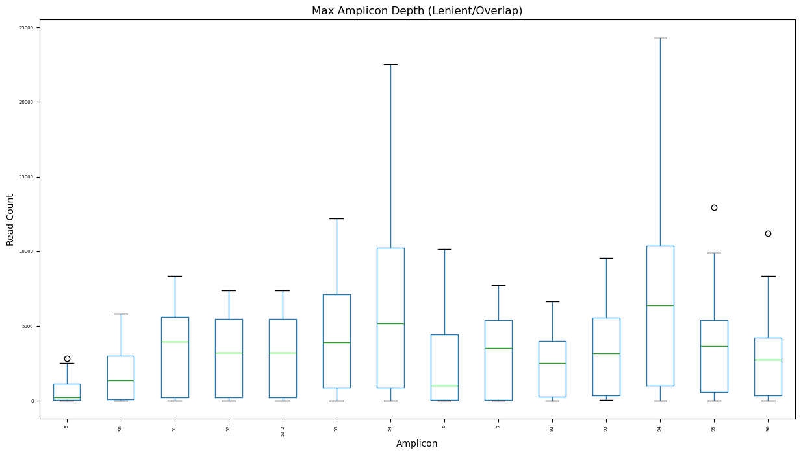
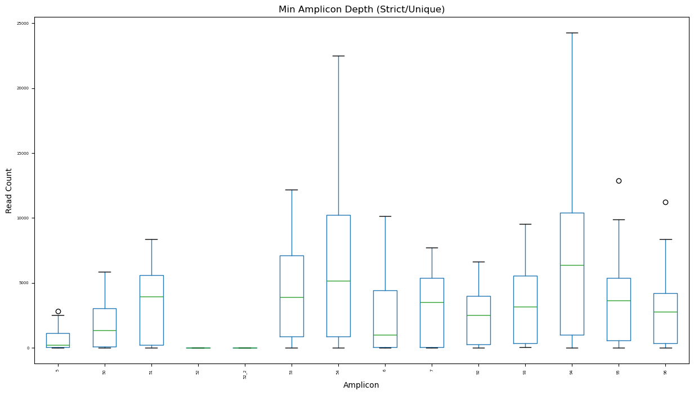
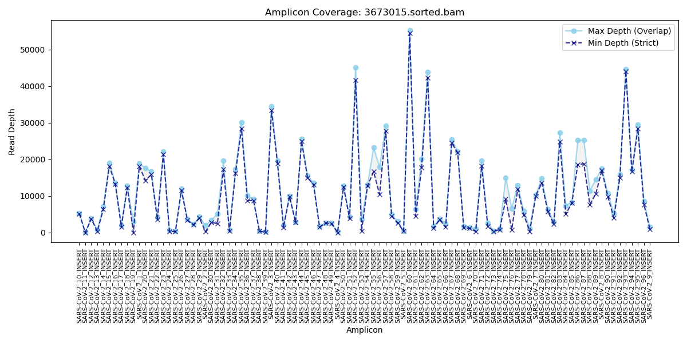
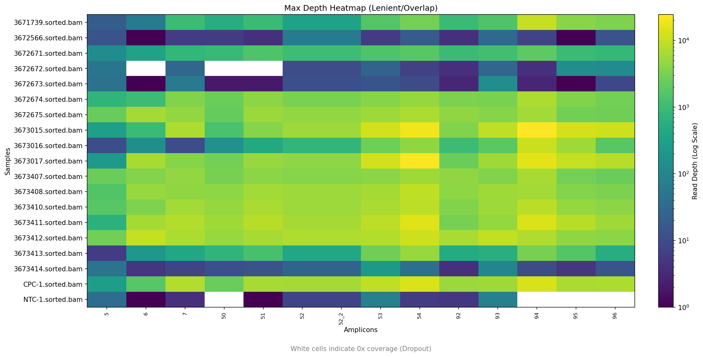
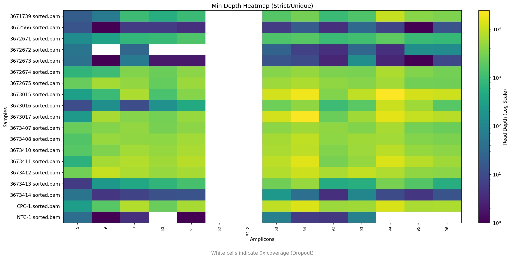
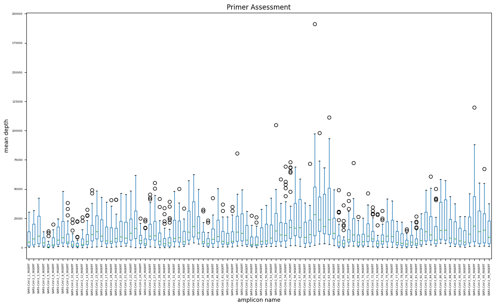

<div align="center">
  
  <h1>Amplicon Coverage Inspector (ACI)</h1>
</div>


**Amplicon Coverage Inspector (ACI)** is a bioinformatics tool designed to quantify coverage depth in amplicon-based sequencing data (e.g., ARTIC, Midnight, Swift protocols).

Unlike standard coverage tools that calculate per-base depth, ACI evaluates coverage **per-amplicon**, providing critical quality control for tiling schemes where overlapping amplicons can create ambiguous read assignments. It is designed to be scheme-agnostic, relying on user-provided BED coordinates rather than rigid primer schemes.

## Installation

### From PyPI
```bash
pip install amplicon_coverage_inspector
```


### From github
```
git clone https://github.com/erinyoung/ACI.git
cd ACI
pip install .
```

### From bioconda
```
conda install -c bioconda aci
```

## Dependencies
- python3.9+
  - pandas
  - matplotlib
  - pysam
  - intervaltree

## Usage
```bash
# Single Sample
aci --bam input.bam --bed amplicon.bed --out results_dir

# Multiple Samples (Explicit list)
aci --bam sample1.bam sample2.bam --bed amplicon.bed --out results_dir

# Batch Processing (Wildcards)
aci --bam *.bam --bed amplicon.bed --out results_dir
```

### Arguments

| Argument | Description |
| :--- | :--- |
| `-b`, `--bam` | Input BAM file(s). Supports multiple files or wildcards. |
| `-d`, `--bed` | Amplicon BED file (4 columns, no header). |
| `-o`, `--out` | Output directory for results (default: `aci`). |
| `-t`, `--threads` | Number of threads for sorting and parallel counting (default: 4). |
| `--tmpdir` | Custom directory for temporary files (default: system tmp). |
| `--fail-threshold` | Min depth required for an amplicon to pass (default: 10). |
| `--fail-percentage` | % of samples that must fail for an amplicon to be flagged (default: 50). |
| `-v`, `--version` | Print version and exit. |

## Methodology: Max vs. Min Logic

In tiling amplicon schemes, amplicons often overlap by ~50bp. A read aligned to this junction physically overlaps two amplicons, creating ambiguity in assignment. ACI quantifies this by calculating two distinct depth metrics:

### 1. Max Depth (Lenient / Overlap)
* **Definition:** Counts any read pair that is strictly contained within an amplicon's boundaries.
* **Ambiguity:** If a read pair fits in the overlap of Amplicon A and Amplicon B, it contributes to the Max Depth of **both**.
* **Interpretation:** Represents the theoretical maximum coverage available for the region.

### 2. Min Depth (Strict / Unique)
* **Definition:** A subset of Max Depth. Counts a read pair **only** if it is strictly contained in **exactly one** amplicon.
* **Ambiguity:** Reads located in overlapping regions are discarded from this metric.
* **Interpretation:** Represents the number of fragments uniquely confirmed to originate from a specific amplicon.


**Significance:** A large divergence between Max and Min depth indicates that the majority of coverage is derived from overlapping regions (or that fragment lengths exceed the non-overlapping amplicon window), which may reduce confidence in variant allele frequency (VAF) calculations for specific amplicons.

## Output Files

ACI generates detailed data tables and visualizations in the specified output directory.

### Data Tables & Reports
| File | Description |
| :--- | :--- |
| `amplicon_max_depth.csv` | **Lenient Depth:** Counts reads strictly contained in an amplicon (including those overlapping neighbors). |
| `amplicon_min_depth.csv` | **Strict Depth:** Counts reads strictly contained in **only one** amplicon (unique assignment). |
| `dropout_report.tsv` | **QC Report:** List of amplicons failing (<10x depth) in >50% of samples. |
| `sample_uniformity_report.tsv` | **QC Report:** Gini coefficient scores indicating coverage evenness per sample. |
| `amplicon_efficiency_matrix.csv` | Table showing the % of total reads consumed by each amplicon. |
| `amplicon_read_assignments.csv` | **Debug:** A log of every read ID and which amplicon(s) it was assigned to. |

### Visualizations
| File | Description | Example |
| :--- | :--- | :---: |
| `amplicon_max_depth_boxplot.png` | Boxplot of **Max (Lenient)** coverage distribution across the cohort. |  |
| `amplicon_min_depth_boxplot.png` | Boxplot of **Min (Strict)** coverage distribution across the cohort. |  |
| `depth_comparison_{sample}.png` | Per-sample line graph showing the gap between Max and Min depth (overlap uncertainty). |  |
| `heatmap_max_depth.png` | **Key Plot:** Log-scale heatmap of Lenient Depth. |  |
| `heatmap_min_depth.png` | **Key Plot:** Log-scale heatmap of Strict Depth. Dark spots indicate dropout. |  |
| `heatmap_efficiency.png` | Linear-scale heatmap showing % of reads per amplicon (detects PCR jackpots). | |

## Input Requirements

### 1. Pre-processing
Primers should be trimmed from the BAM file prior to analysis. Primer sequences force alignment to the reference and mask variants. ACI is designed to analyze biological insert coverage, not primer binding.

### 2. Bed File Format
ACI requires a standard 4-column BED file defining the **Amplicon** (insert) coordinates, not the primer binding sites.

**Format:** `Reference` `Start` `End` `Name` (Tab-delimited, no header).

* **Reference:** Must match the BAM header exactly (e.g., `MN908947.3`).
* **Coordinates:** 0-based, half-open.
* **Do NOT use a primer scheme BED file.** A primer BED file lists binding sites (e.g., Left: 30-54, Right: 385-410). ACI requires the resulting amplicon coordinates (e.g., 55-384).

**Example:**
```
MN908947.3	54	385	1	1	+
MN908947.3	342	704	2	2	+
MN908947.3	664	1004	3	1	+
MN908947.3	965	1312	4	2	+
MN908947.3	1264	1623	5	1	+
MN908947.3	1595	1942	6	2	+
MN908947.3	1897	2242	7	1	+
MN908947.3	2205	2568	8	2	+
MN908947.3	2529	2880	9	1	+
MN908947.3	2850	3183	10	2	+
```

## Testing

This repository contains test data in the `tests/data` subdirectory. To verify the installation:

```bash
aci -b tests/data/test.bam -d tests/data/test.bed -o testing
```

The resulting image should look something like the following.


## Background & Motivation

Evaluating primer effectiveness for amplicon-based NGS often requires complex workflows dependent on specific primer scheme formats. While tools like `samtools ampliconstats` exist, they can be rigid regarding input formats and naming conventions, often failing with custom or highly overlapped primer sets.

ACI was developed to provide a flexible, standalone alternative that strictly evaluates coverage geometry, offering granular insight into library performance regardless of the underlying chemistry.

## Contributing
Contributions are welcome! Please feel free to [open an issue](https://github.com/erinyoung/ACI/issues) or submit a pull request.

## Future Directions
- Support for single reads
- Support for baits

## License
This project is licensed under the MIT License.

## Acknowledgments
**Google Gemini** was used to refactor and modernize this codebase, including introducing a `src` layout, implementing the strict containment logic, and optimizing parallel processing.